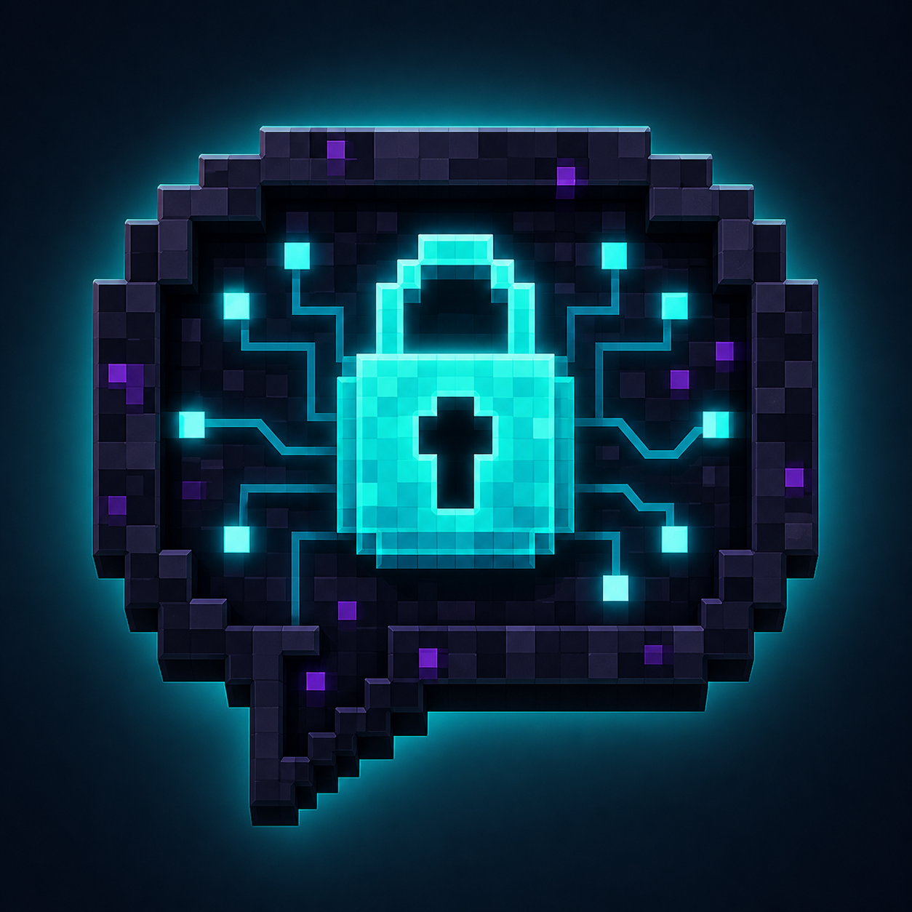

# CipherChannels



CipherChannels is a client-only Fabric and NeoForge mod that encrypts complete Minecraft public-chat messages between people who share a secret invite. The server needs no plugin. It relays and signs a fixed 256-character ciphertext instead of receiving the plaintext.

CipherChannels 2.1 uses the same `CC2` protocol, channels and invites as 2.0. CipherChannels 1.x remains incompatible.

## Quick start

1. Open CipherChannels from chat or its configurable key, then create a channel or import an invite.
2. Share or import the same invite privately. A fingerprint can optionally confirm that both people have the same key.
3. Turn on encrypted chat from Overview.

Keys are not saved. Restarting Minecraft clears every key, so import the invite again before using an existing channel. The manager clearly shows whether encryption is on, which channel is active, whether its key is loaded, and why a send was blocked.

## Downloads

Install exactly one JAR matching the Minecraft version and loader.

| Minecraft | Loader | Java | Required runtime | JAR |
|---|---|---:|---|---|
| 1.21.1 | Fabric | 21 | Fabric Loader 0.19.3+, Fabric API 0.116.15+1.21.1+ | `cipherchannels-2.1.0+fabric.1.21.1.jar` |
| 1.21.1 | NeoForge | 21 | NeoForge 21.1.248+ | `cipherchannels-2.1.0+neoforge.1.21.1.jar` |
| 1.21.11 | Fabric | 21 | Fabric Loader 0.19.3+, Fabric API 0.141.6+1.21.11+ | `cipherchannels-2.1.0+fabric.1.21.11.jar` |
| 1.21.11 | NeoForge | 21 | NeoForge 21.11.45+ | `cipherchannels-2.1.0+neoforge.1.21.11.jar` |
| 26.1 | Fabric | 25 | Fabric Loader 0.19.3+, Fabric API 0.145.1+26.1+ | `cipherchannels-2.1.0+fabric.26.1.jar` |
| 26.1 | NeoForge | 25 | NeoForge 26.1.0.19-beta+ | `cipherchannels-2.1.0+neoforge.26.1.jar` |
| 26.1.2 | Fabric | 25 | Fabric Loader 0.19.3+, Fabric API 0.155.2+26.1.2+ | `cipherchannels-2.1.0+fabric.26.1.2.jar` |
| 26.1.2 | NeoForge | 25 | NeoForge 26.1.2.94+ | `cipherchannels-2.1.0+neoforge.26.1.2.jar` |
| 26.2 | Fabric | 25 | Fabric Loader 0.19.3+, Fabric API 0.156.0+26.2+ | `cipherchannels-2.1.0+fabric.26.2.jar` |
| 26.2 | NeoForge | 25 | NeoForge 26.2.0.53-beta+ | `cipherchannels-2.1.0+neoforge.26.2.jar` |

Fabric API is required on Fabric. NeoForge builds have no extra mod dependency. Mod Menu is optional.

## What the server sees

The server sees your account, timing, destination, ordering, selected transport alphabet, and one fixed-size 256-character ciphertext. It can block, delay, reorder, delete, replace, or replay delivery. It cannot read authenticated plaintext or create a frame accepted by channel holders without the invite. Minecraft signs the ciphertext, not the plaintext.

High Capacity is the default. It guarantees 443 raw UTF-8 bytes and can carry compressible text up to the 4,096-byte restored-text limit. Compatibility is a manually selected per-server ASCII fallback with 155 raw bytes. CipherChannels never truncates, splits, or falls back to plaintext.

Slash commands remain plaintext because the server must interpret them. The UI warns before sending one.

## Keys and recovery

The invite is the complete 256-bit shared secret. Anyone holding it can read and create valid channel messages. `[CC]` proves possession of that shared secret, not who authored a message.

Keys and replay history exist only for the current Minecraft session. Replay protection retains up to 4,096 authenticated frames for six hours, but restarting clears it. Persistent settings contain only channel names, UUIDs, fingerprints, bindings, transport overrides, the active selection, and enabled intent.

Fingerprints are optional comparison aids. Matching the full fingerprint confirms the same shared key; CipherChannels does not store a trust decision. If an invite may be exposed, rotate the channel key, distribute the new invite privately, and stop using the old one.

Unsafe or unreadable settings fail closed. Public chat remains blocked until recovery or an explicit reset permits plaintext mode.

## Privacy boundaries

CipherChannels does not provide anonymity, forward secrecy, individual identity, membership revocation, protection after key theft, protection from a compromised device, or command encryption. Unknown or malicious client mods can read Minecraft process memory.

Vanilla transformed-message logging is suppressed. Supported Chat Patches logging receives a fixed placeholder instead of plaintext or ciphertext. If an installed Chat Patches version cannot be protected, encrypted sending and incoming decryption pause. Existing old logs are never deleted automatically.

## Build and verify

Use Java 25 to run the checked-in Gradle wrapper; Java 21 targets use a toolchain automatically.

```sh
./gradlew clean test releaseBuild --no-daemon
./scripts/reproducible-build.sh
```

Release files appear in `build/release`. The build validates all ten JARs, creates the source ZIP, and writes `SHA256SUMS`. Dependency verification and the wrapper distribution checksum are enabled. Tagged GitHub builds generate provenance attestations.

See [Protocol](PROTOCOL.md), [Security](SECURITY.md), [Compatibility](COMPATIBILITY.md), [Changelog](CHANGELOG.md), [interoperability vectors](vectors/README.md), and [third-party notices](THIRD_PARTY_NOTICES.md). CipherChannels is [All Rights Reserved](LICENSE).
